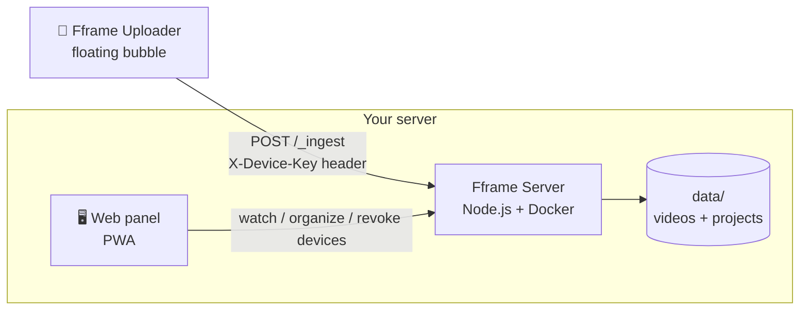

<div align="center">

# 🎬 Fframe

**Your own "Frame.io" — self-hosted, no subscription, no artificial storage limit.**

Receive videos from any camera straight to your own server, with a lightweight proxy generated
on-device, and a web panel to organize, watch, and share.

[](LICENSE)
[](server)
[](server)
[](android-app)
[](#contributing)

🌐 [Português](README.md) · **[English](README.en.md)**

</div>

---

## What it is

**Fframe** solves a simple problem: "camera to cloud" apps (Frame.io, etc.) charge a monthly fee
and store your videos on someone else's server. Fframe is the same flow — record, auto-upload a
lightweight proxy, watch and organize in a panel — but running **on your own server**, with your
own data.

The project has two parts, each with its own detailed README:

| | |
|---|---|
| 📦 [`server/`](server/README.en.md) | Self-hosted Node.js server: receives videos, organizes them into projects, web panel (PWA). |
| 📱 [`android-app/`](android-app/README.en.md) | Android app with a floating bubble: detects any video recorded by any camera app and sends it to your server. |

## Architecture



## Features

- 🔓 **No subscription, no artificial limit** — storage is just your server's disk
- 🎞️ **Lightweight proxy generated on-device** before upload (720 / 1080 LQ / 1080 HQ)
- 🫧 **Floating bubble** over any camera app — not tied to a specific one
- 📷 **QR code pairing** — scan and you're configured, no typing server/key by hand
- 🔑 **Multiple devices, each with its own key**, individually revocable from the panel
- 💬 **Frame.io-style review** — custom player with **comment pins on the playback bar**, **timecode** (`HH:MM:SS:FF`) and **frame stepping**, shortcuts (space/J-K-L/arrows), **range** comments (in/out), **threaded replies**, and comments that **light up** as the playhead passes them
- 🌐 **Bilingual panel** (Portuguese and English) with instant language switching, no reload
- 🗂️ Web panel (PWA): projects, gallery, player, deletion
- 📥 Upload queue (resumes automatically once the network is back)

## Quick start

### 1. Bring up the server

```bash
cd server
cp .env.example .env      # set PUBLIC_BASE if exposing it publicly
docker compose up -d --build
```

Open `http://localhost:3260` and create your admin user/password on first access.

### 2. Build the app (or grab the prebuilt APK from [Releases](../../releases))

```bash
cd android-app
./gradlew assembleRelease
```

### 3. Pair them

In the panel: **Devices → Add device** → scan the QR code with the app. Done — record in any
camera app and the video uploads itself.

Configuration details, environment variables, and build instructions: see the
[`server/`](server/README.en.md) and [`android-app/`](android-app/README.en.md) READMEs.

## Languages

| Part | Languages |
|---|---|
| 🖥️ **Web panel** | 🇧🇷 Portuguese and 🇬🇧 English — switch via a **dropdown** (on the login screen and in the sidebar). Your choice is saved in the browser and also applies to dates and times. On first visit the language is detected from your browser. |
| 📱 **Android app** | 🇧🇷 **Portuguese only.** The app's interface is not translated. |

To **add a new language** to the panel, append a block to
[`server/public/i18n.js`](server/public/i18n.js) with the same keys — the dropdown picks it up
automatically, nothing else to change. Missing keys fall back to Portuguese.

## Running on Proxmox

Fframe Server is just a Docker Compose container — it doesn't run "directly" on the hypervisor,
but inside a VM or LXC that Proxmox hosts. Two lightweight options (the container is capped at
512 MB RAM / 1 CPU):

- **LXC (recommended)** — create an LXC container (Debian/Ubuntu), install Docker inside it, and
  run `docker compose up -d` as usual. This is the lightest path; the
  [Proxmox VE Helper-Scripts](https://community-scripts.github.io/ProxmoxVE/) have a ready-made
  "Docker LXC" script that saves you the manual setup.
- **VM** — if you prefer full isolation (own kernel), spin up a small VM (Debian/Ubuntu, 1 vCPU /
  1 GB RAM is plenty) with Docker and run it the same way.

Either way, expose the port from `docker-compose.yml` (default `3260`) on your Proxmox network,
and if you want access from outside your home, put a reverse proxy in front (Nginx Proxy Manager,
Caddy, or a Cloudflare Tunnel) pointing at the `PUBLIC_BASE` from your `.env`.

## Security

- No secret, IP, or domain is hardcoded in the code — everything is configured via `.env`
  (server) or typed/paired by QR in the app (never embedded in the APK)
- Admin password hashed with bcrypt; httpOnly + secure + sameSite session
- Each device gets its own random 48-character key, individually revocable
- Managing devices (create/revoke) requires an admin session — a device key alone cannot create
  or revoke other keys
- Container runs with `cap_drop: ALL`, `no-new-privileges`, memory limit, and no extra privileges

See full details in [`server/README.en.md`](server/README.en.md#security) and
[`android-app/README.en.md`](android-app/README.en.md#security--privacy).

## Contributing

Issues and PRs are welcome. This is a study/interoperability project — use it with apps and
accounts you have the right to use.

## License

[MIT](LICENSE)
