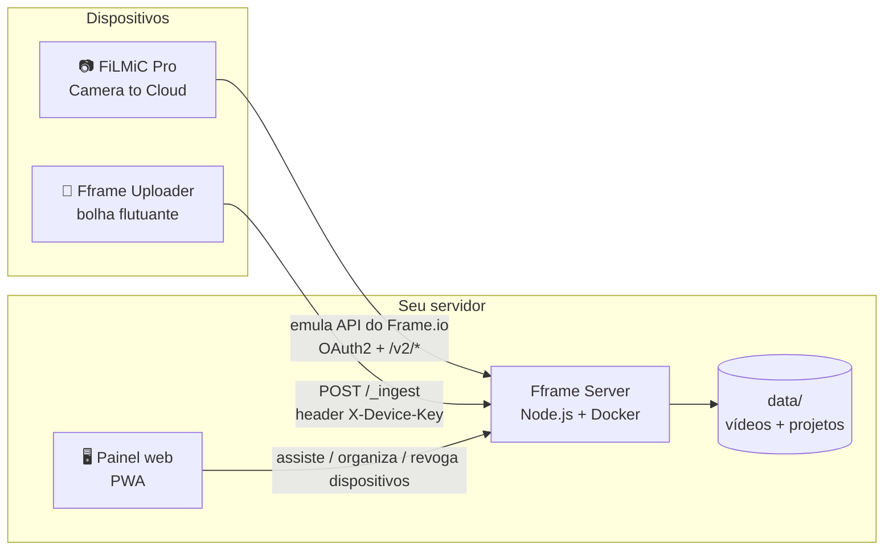

<div align="center">

# 🎬 Fframe

**Seu próprio "Frame.io" — auto-hospedado, sem mensalidade, sem limite de armazenamento.**

Receba vídeos de qualquer câmera direto no seu servidor, com proxy leve gerado no aparelho,
painel web e compatibilidade com o fluxo *Camera to Cloud* do FiLMiC Pro.

[](LICENSE)
[](server)
[](server)
[](android-app)
[](#contribuindo)

</div>

---

## O que é

O **Fframe** resolve um problema simples: apps de "camera to cloud" (Frame.io, etc.) cobram
mensalidade e guardam seus vídeos no servidor de outra empresa. O Fframe é o mesmo fluxo — grava,
sobe um proxy leve automaticamente, assiste e organiza em um painel — mas rodando **no seu próprio
servidor**, com seus próprios dados.

O projeto tem duas partes, cada uma com seu README detalhado:

| | |
|---|---|
| 📦 [`server/`](server) | Servidor Node.js self-hosted: recebe vídeos, organiza em projetos, painel web (PWA), compatível com o protocolo C2C do FiLMiC Pro. |
| 📱 [`android-app/`](android-app) | App Android com bolha flutuante: detecta qualquer vídeo gravado por qualquer app de câmera e envia pro seu servidor. |

## Arquitetura



## Recursos

- 🔓 **Sem mensalidade, sem limite artificial** — o armazenamento é o disco do seu servidor
- 🎞️ **Proxy leve gerado no próprio aparelho** antes do envio (720 / 1080 LQ / 1080 HQ)
- 🫧 **Bolha flutuante** sobre qualquer app de câmera — não precisa ser o FiLMiC
- 📷 **Pareamento por QR code** — escaneia e já está configurado, sem digitar servidor/chave
- 🔑 **Múltiplos dispositivos, cada um com sua própria chave**, revogável individualmente pelo painel
- 🎥 Compatível com o protocolo *Camera to Cloud* do **FiLMiC Pro**
- 🗂️ Painel web (PWA): projetos, galeria, player, exclusão
- 📥 Fila de envio (retoma sozinho quando a rede volta)

## Início rápido

### 1. Suba o servidor

```bash
cd server
cp .env.example .env      # ajuste PUBLIC_BASE se for expor publicamente
docker compose up -d --build
```

Acesse `http://localhost:3260` e crie seu usuário/senha de admin no primeiro acesso.

### 2. Compile o app (ou baixe o APK pronto em [Releases](../../releases))

```bash
cd android-app
./gradlew assembleRelease
```

### 3. Pareie

No painel: **Dispositivos → Adicionar dispositivo** → escaneie o QR com o app. Pronto — grave em
qualquer app de câmera e o vídeo sobe sozinho.

Detalhes de configuração, variáveis de ambiente e compilação: veja os READMEs de
[`server/`](server/README.md) e [`android-app/`](android-app/README.md).

## Rodando em Proxmox

O Fframe Server é só um container Docker Compose — não roda "direto" no hypervisor, mas dentro de
uma VM ou LXC que o Proxmox hospeda. Dois caminhos, ambos leves (o container usa 512 MB de RAM e 1
CPU no limite configurado):

- **LXC (recomendado)** — crie um container LXC (Debian/Ubuntu), instale o Docker dentro dele e
  rode o `docker compose up -d` normalmente. É o caminho mais leve; os
  [Proxmox VE Helper-Scripts](https://community-scripts.github.io/ProxmoxVE/) têm um script pronto
  de "Docker LXC" que poupa a instalação manual.
- **VM** — se preferir isolamento total (kernel próprio), sobe uma VM pequena (Debian/Ubuntu, 1
  vCPU / 1 GB RAM já sobra) com Docker e roda do mesmo jeito.

Em qualquer um dos dois, exponha a porta do `docker-compose.yml` (padrão `3260`) na rede do
Proxmox e, se quiser acesso de fora de casa, coloque um reverse proxy na frente (Nginx Proxy
Manager, Caddy, ou um túnel Cloudflare) apontando pro `PUBLIC_BASE` do `.env`.

## Segurança

- Nenhum segredo, IP ou domínio fica hardcoded no código — tudo é configurado via `.env` (servidor)
  ou digitado/pareado por QR no app (nunca embutido no APK)
- Senha de admin com hash bcrypt; sessão httpOnly + secure + sameSite
- Cada dispositivo tem sua própria chave aleatória de 48 caracteres, revogável individualmente
- Gerenciar dispositivos (criar/revogar) exige sessão de admin — uma chave de dispositivo sozinha
  não consegue criar ou revogar outras
- Container roda com `cap_drop: ALL`, `no-new-privileges`, limite de memória e sem privilégios extras

Veja detalhes completos em [`server/README.md`](server/README.md#segurança) e
[`android-app/README.md`](android-app/README.md#segurança--privacidade).

## Contribuindo

Issues e PRs são bem-vindos. Este é um projeto de estudo/interoperabilidade — use com apps e
contas que você tem direito de usar.

## Licença

[MIT](LICENSE)
